# CFD

Computational fluid dynamics (CFD) is a branch of fluid mechanics that uses numerical analysis and data structures to analyze and solve problems that involve fluid flows.

### Methodology

Some basic procedures during preprocessing are:

- The geometry and physical bounds of the problem can be defined using computer aided design (CAD). From there, data can be suitably processed (cleaned-up) and the fluid volume (or fluid domain) is extracted.
- The volume occupied by the fluid is divided into discrete cells (the mesh). The mesh may be uniform or non-uniform, structured or unstructured, consisting of a combination of hexahedral, tetrahedral, prismatic, pyramidal or polyhedral elements.
- Physical modeling is defined – for example, the equations of fluid motion + enthalpy + radiation + species conservation
- Boundary conditions are defined. This involves specifying the fluid behaviour and properties at all bounding surfaces of the fluid domain. For transient problems, the initial conditions are also defined.
- The simulation is started and the equations are solved iteratively as a steady-state or transient.
- Finally, a postprocessor is used for the analysis and visualization of the resulting solution.

### Definitions

The term compressible refers to the relationship between density and pressure. If a flow is compressible, changes in fluid pressure affect its density and vice versa. Compressible flows involve gases at very high speeds.

One major difference between compressible and incompressible flow is seen in both the physical nature of pressure and consequently, the mathematical character of the pressure equation. For incompressible flow, downstream effects are felt everywhere immediately and the pressure equation is mathematically elliptic, requiring downstream boundary conditions. For compressible flow, particularly supersonic flows, downstream pressure cannot affect anything upstream and the pressure equation is hyperbolic, requiring only upstream boundary conditions.

Laminar flow is characterized by smooth, steady fluid motion. Turbulent flow is fluctuating and agitated motion. The measure of whether a flow is laminar or turbulent is the speed of the fluid. Laminar flow is typically much slower than turbulent flow. The dimensionless number which is used to classify a flow as either laminar or turbulent is the Reynolds number defined as:

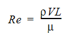

Where is the density, V is the velocity and U is the viscosity. For Reynolds numbers greater than ~2500, the flow exhibits turbulent flow phenomena. Most engineering flows are turbulent.

Between the laminar and turbulent flow regimes is the transitional flow regime. In this flow regime, the flow goes through several stages of non-linear behavior before it becomes fully turbulent. These stages are highly unstable, the flow can rapidly change from one type of behavior (turbulent spots, e.g.) to another (vortex breakdown, e.g.) and back again. Due to the unstable nature of this type of flow, it is difficult to numerically predict.

The three-dimensional time-dependent continuity, Navier-Stokes and energy equations apply to laminar as well as turbulent flow. However, due to the infinite number of time and length scales inherent in turbulent flows, the solution of these equations require a huge number of finite elements (on the order of 106 to 108) even for a simple geometry as well as nearly infinitesimally small time steps. For most practical applications, it is unreasonable to model the flow in this manner.

To circumvent the need for such immense computer resources, the governing pdes are averaged over the scales present. There are several choices of scale types available for averaging. Autodesk Simulation CFD solves the time-averaged governing equations.

The time-averaged equations are obtained by assuming that the dependent variables can be represented as a superposition of a mean value and a fluctuating value, where the fluctuation is about the mean. For example, the x-velocity component can be written as:

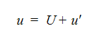

where U is the mean velocity and u' is the fluctuation about that mean. This representation is substituted into the governing equations and the equations themselves are averaged over time. Using the notation that capital letters represent the mean values and lower case letters represent fluctuating values except for temperature, the averaged governing equations can be written as:

Continuity Equation

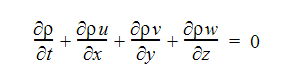

Wind tunnels are large tubes with air blowing through them which are used to replicate the interaction between air and an object flying through the air or moving along the ground. Researchers use wind tunnels to learn more about how an aircraft will fly. NASA uses wind tunnels to test scale models of aircraft and spacecraft. Some wind tunnels are large enough to contain full-size versions of vehicles. The wind tunnel moves air around an object, making it seem as if the object is flying.

### Pressure measurements

Pressure across the surfaces of the model can be measured if the model includes pressure taps. This can be useful for pressure-dominated phenomena, but this only accounts for normal forces on the body.

### Flow visualizations

Because air is transparent it is difficult to directly observe the air movement itself. Instead, multiple methods of both quantitative and qualitative flow visualization methods have been developed for testing in a wind tunnel.

### Physics of fluid

Fluid is liquid and gas. For example, water and air. Fluid has many important properties, such as
velocity, pressure, temperature, density and viscosity.
The density (1) of a fluid is its mass per unit volume. If the density of fluid is constant (or the
change is very small), we call the fluid is incompressible fluid. If the density of fluid is not constant,
we call the fluid is compressible fluid. Normally, we can treat water and air as incompressible fluid.
If the fluid is incompressible, we can simplify the equations for this type of fluid.

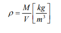

The viscosity (2) is an internal property of a fluid that offers resistance to flow. For example, to stir
water is much easier than to stir honey because the viscosity of water is much smaller than honey

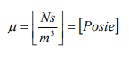

## Process

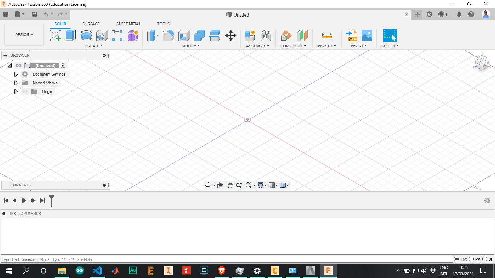

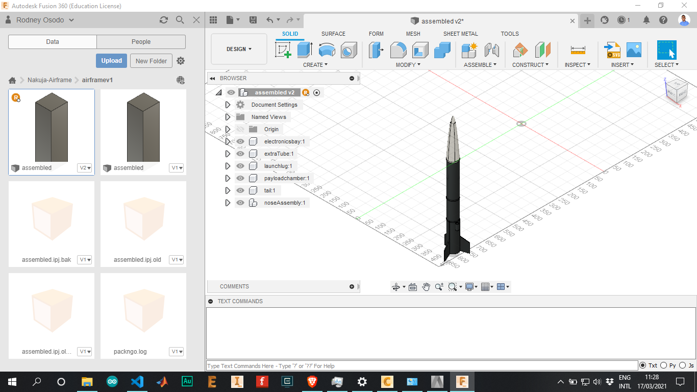

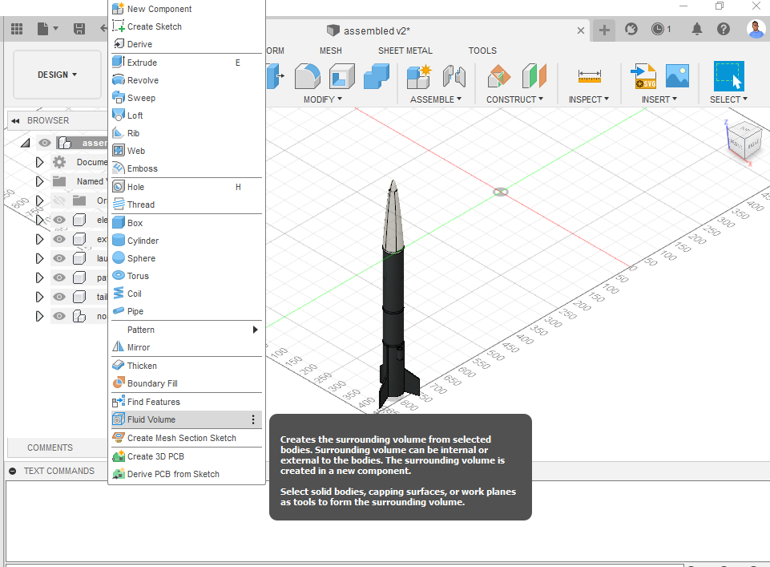

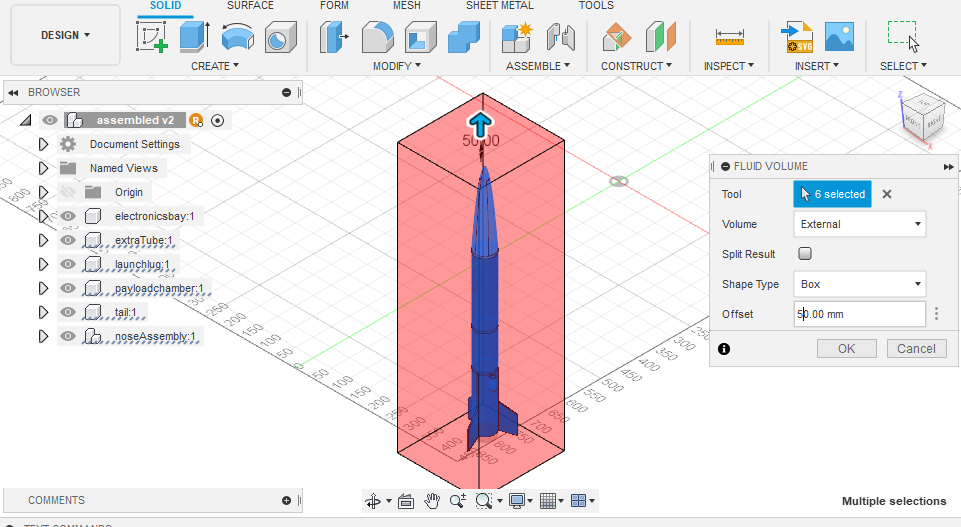

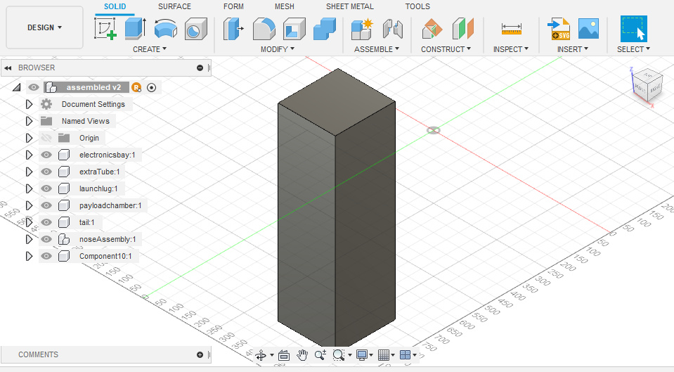

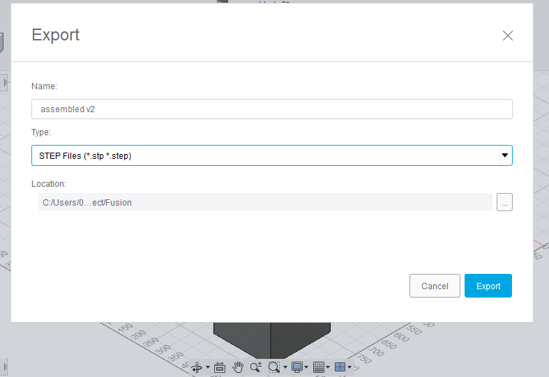

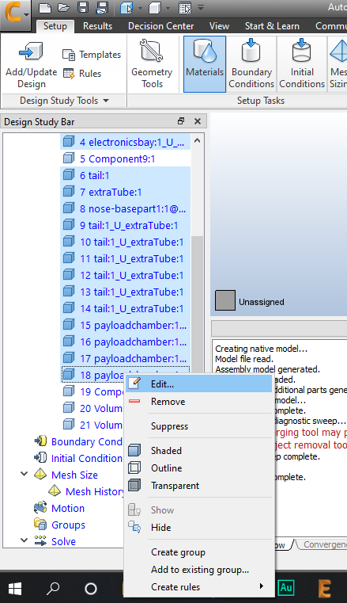

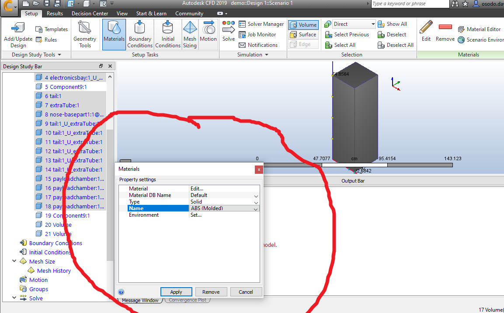

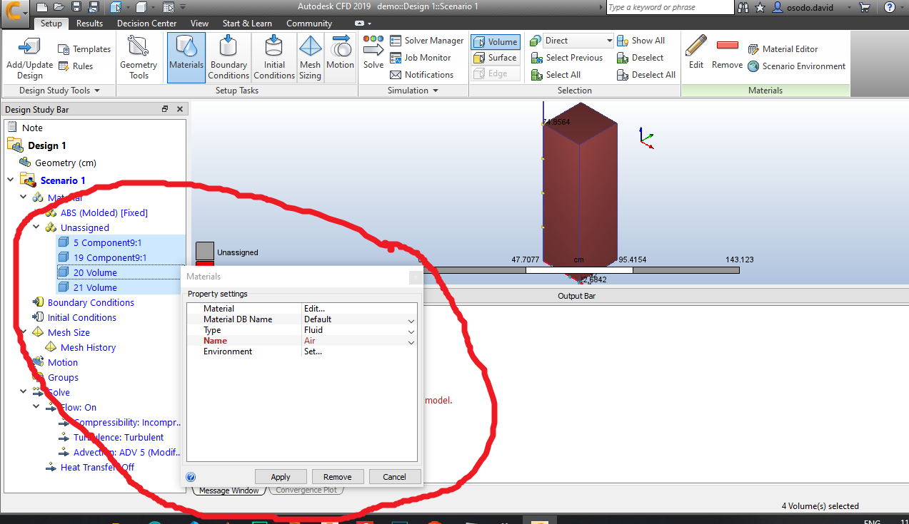

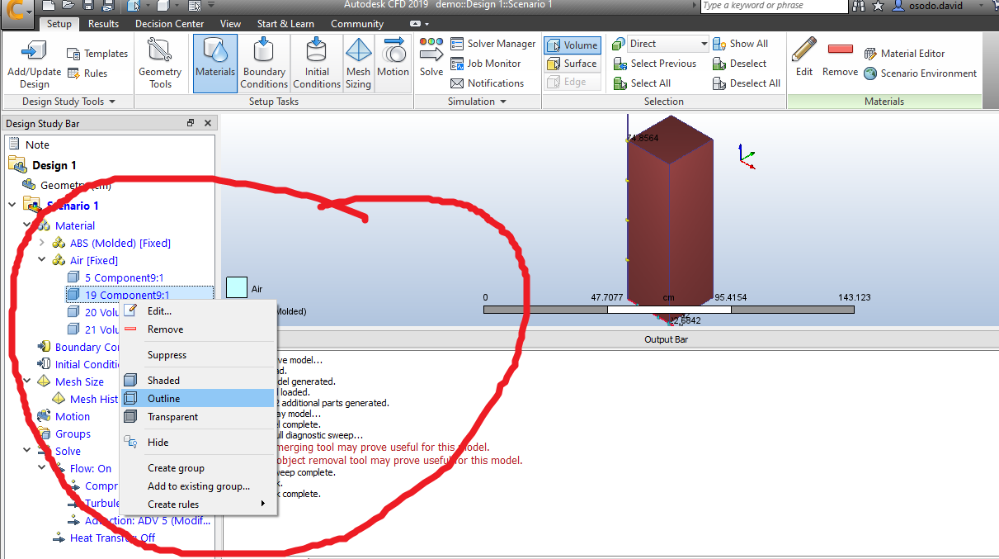

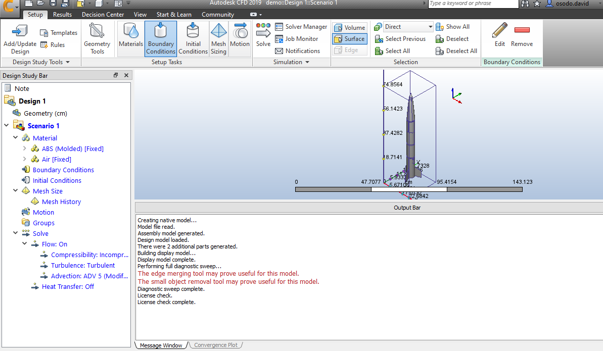

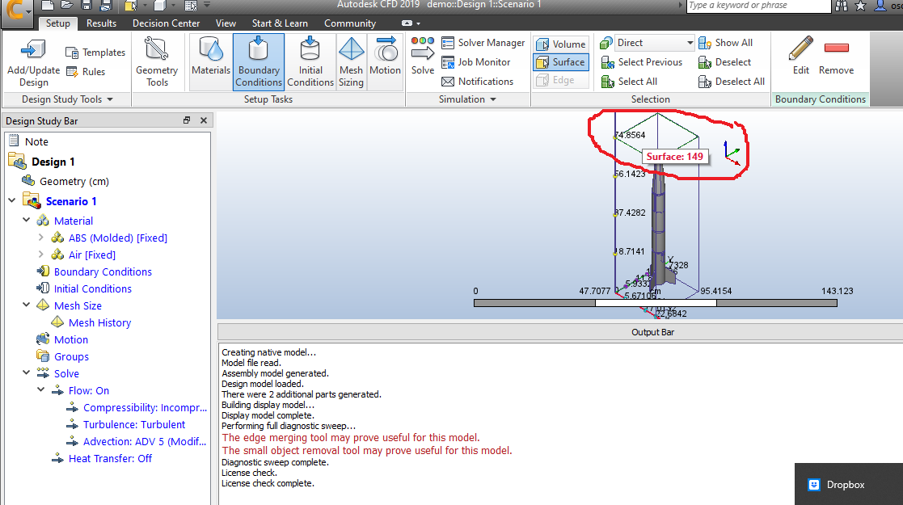

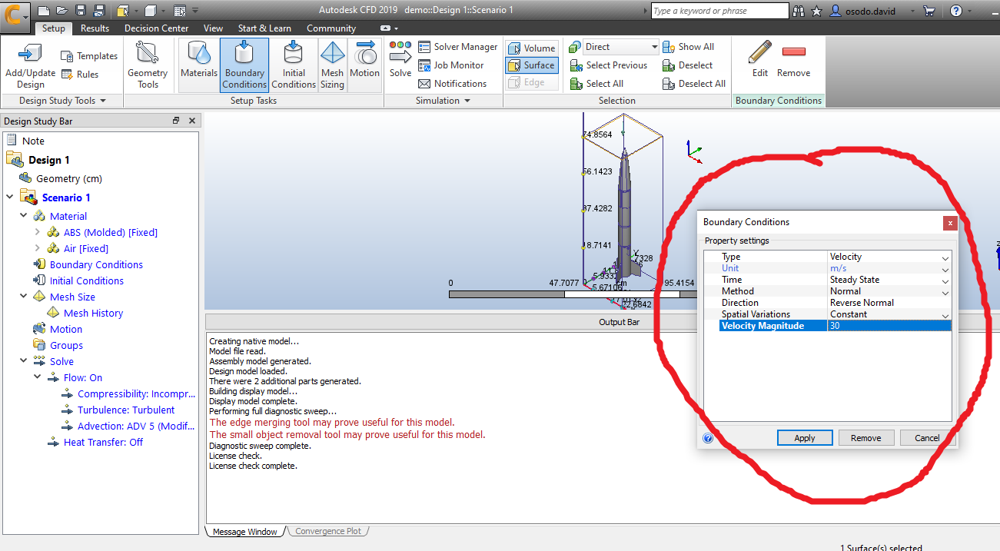

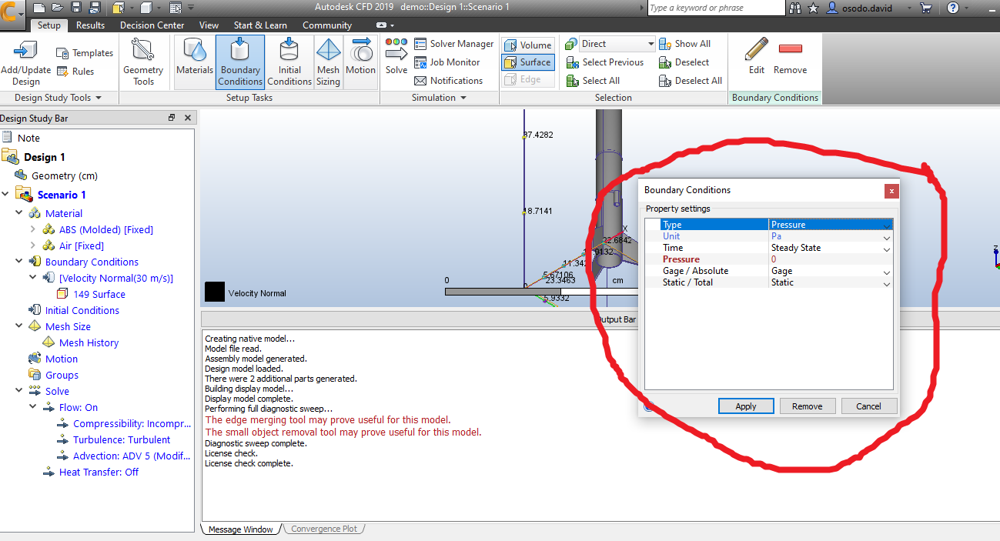

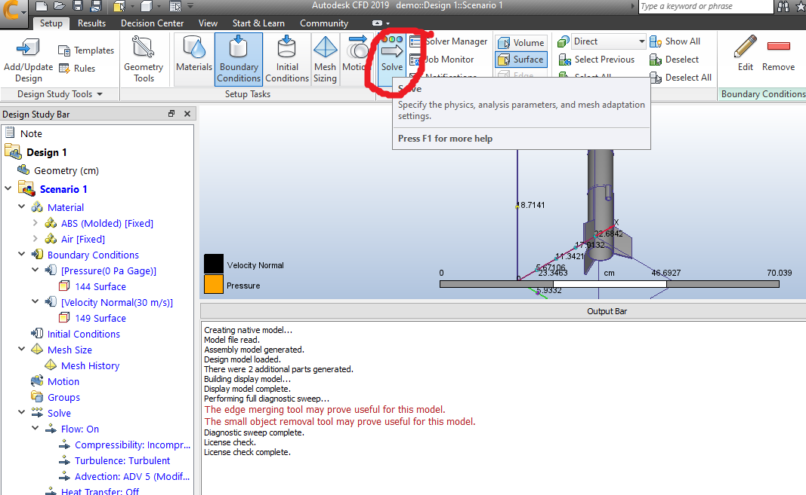
