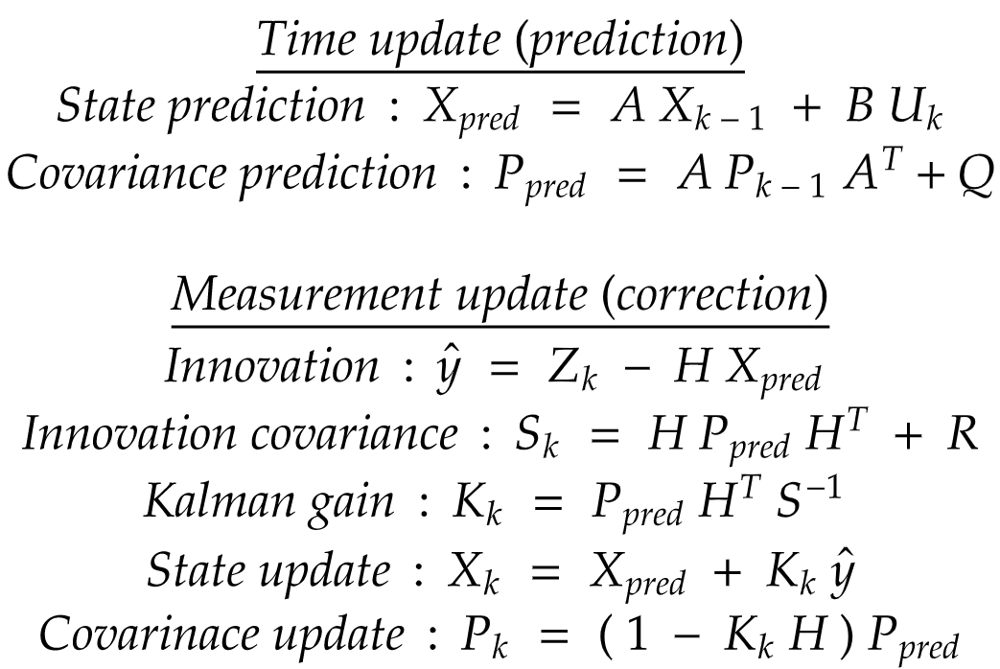
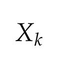
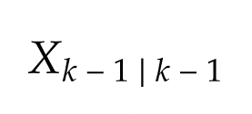
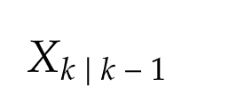
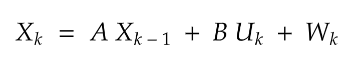
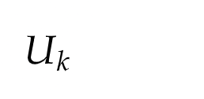
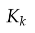
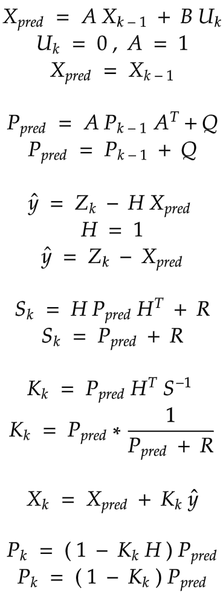
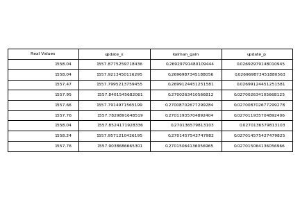
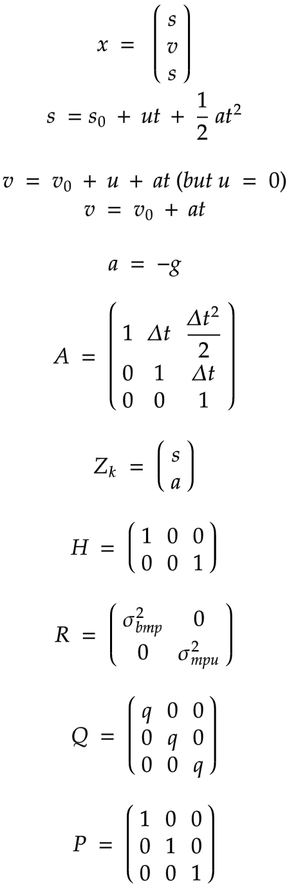

# Kalman Filter

DISCLAIMER: This guide teaches amateur-level Kalman filtering for hobbyists. If lives depend on your Kalman filter (such as manned aviation, ICBMs, medical instruments, etc), do not rely on this guide! I skip a lot of details necessary for serious use!

It's nearly impossible to grasp the full meaning of Kalman Filter by starting from definitions and complicated equations (at least for us mere mortals).

Generally, our purpose is to find Estimate of X at state k, the estimate of the signal x based on the current and previous readings. And we wish to find it for each consequent k's.

You can trust the gyroscope for short term measurements and trust acceleration for long term measurements.

A small take away
> Kalman filter finds the most optimum averaging factor for each consequent state also, somehow remembers a little about the past states.

## General rule of thumb

We will begin by studing the bare bones of kalman filter before implementing it. Though the technical jargon may be tough, just hang in there.



### Definitions

Some of the definitions we need to cover are listed here:

**Current state** This is the current state of the system.



**Previous state** This is the previous state of the system.



**Priori state** This is the estimated state at time k given observations upto and including time k.



The system state can be observed through `Zk` which is the Hidden Markov Model. The state of the system is given by,


`A` is the state transition and is applied to the previous state



`Uk` is the control input.

`B` is the control input matrix.

`Wk` is the noise of the system with a zero mean and covariance Q at time k and is called process noise. The process noise covariance matrix we considered as teh estimate of the bias and depends on time.

`H` is the observation model used to map true state space to observed state space.



`Kalman gain` is the difference between measured and estimated values.

### Process

#### A. Predict

##### 1. Estimate the current state

We use extra input to estimate the state at time k called the priori state

##### 2. Estimate priori error covariance based on the previous

This matrix estimates how much we trust our current values of estimated state. The smaller ther value the more we trust it. Error covariance will increase since we last updated the estimate of the state, therefore we multiplied the error covariance matrix by the state transition model A and its transpose At and current process noise Qk

#### B. Update

##### 1. Compute the difference bewtween measurement `Zk` and priori state

`H` is the observation model and maps the priori state into the observed state.

##### 2. Calculate innovation covariance

Tries to predict how much we trust the measurement based on priori error covariance and measurement covariance matrix.

H maps the priori error covariance matrix into obervation matrix. Bigger measurement noise, a bigger value of S hence not trusting the measurement

###### 3. Calculate the kalman gain

We use H to extract data from state error covariance and compare with current estimation. If you don't know the state at startup initialize the error covariance at 0.

###### 4. Update posteriori estimate of the current state

###### 5. Update posteriori error covariance

## Single variable kalman filter

In this example we will be using the bmp180 sensor. This sensor measures the altitude above sea level of its position. It will help us determine the height of the rocket. Out of the box we install the `<Adafruit_BMP085.h` library. Using the example sketch from the library, since we are interested in the altitude we remove the other code and remain with altitude measurements

```c++
#include <Wire.h>
#include <Adafruit_BMP085.h>
#define seaLevelPressure_hPa 1024

Adafruit_BMP085 bmp;
  
void setup() {
    Serial.begin(115200);
    if (!bmp.begin()) {
        Serial.println("Could not find a valid BMP085 sensor, check wiring!");
        while (1) {}
    }
}
  
void loop() {
    Serial.print("Real altitude = ");
    Serial.print(bmp.readAltitude(seaLevelPressure_hPa * 100));
    Serial.println(" meters");
    delay(500);
}
```

If we plot this values while maintaining a stationary point we can be able to see the noise in the readings.

!TODO Insert image of noise readings from a single point

For a start we will try to estimate a scalar constant, altitude reading from a source. So we assume the constant value is `x metres` and we have some noise in the data above and below `x metres`. The get the standard deviation from the datasheet of the instrument we are trying to read.

## Let's build our model



In each step we have tried and reduced the equations to a very simple form.
Above all, we have a 1 dimensional signal problem, so every entity in our model is a numerical value, not a matrix.

We have no such control signal `uk`, and it's out of the game. As the signal is a constant value, the constant A is just 1, because we already know that the next value will be same as the previous one. The value H = 1, because we know that the measurement is composed of the state value and some noise. Finally, let's assume that we have the following measurement values:

```txt
1558.04
1558.04
1557.47
1557.95
1557.66
1557.76
1558.04
1558.24
1557.76
```

Matrix ` Q ` represents process noise. It decides accuracy and time lag in the estimated value.
Higher ` Q ` results in a higher gain and hence more weight to the noisy measurements. The estimation accuracy is thereby compromised.
Lower ` Q ` leads to a better estimation accuracy but a time lag may be introduced to the estimated value.
` Q ` is therefore a tuning factor and a trade-off between estimation accuracy and time lag is made when deciding this value.

Matrix ` R ` represents measurement noise. It represents sensor noise characteristics.
` R ` is calculated from the sensor accuracy which is represented using a standard deviation of measured values from true values.
` Variance ` = ` sd ^ 2 `
` R ` = ` Variance ` * ` eye(3,3) `

Matrix ` H ` is what you need to multiply the incoming measurement to convert it to a state. Since we get the altitude directly, we just multiply by 1.
`H = 1`
Matrix `B` is the control matrix. It's a constant altitude and there's no input in the model we can change to affect anything, so we'll set it to 0.
`B = 0`
Matrix `Q` is the process covariance. Since we know the exact situation, we'll use a very small covariance.
`Q = 0.00001`
Matrix `R` is the measurement covariance. We'll use a conservative estimate of 0.1.
`R = 0.1`
Matrix `xhat` is your initial prediction of the altitude. We'll set it to 3 to show how resilient the filter is.
`xhat = 1520`
Matrix `P` is your initial prediction of the covariance. We'll just pick an arbitrary value (1) because we don't know any better.
`P = 1`


OK, we should start from somewhere, such as k=0. We should find or assume some initial state. Here, we throw out some initial values. Let's assume estimate of X0 = 0, and P0 = 1. Then why didn't we choose P0 = 0 for example? It's simple. If we chose that way, this would mean that there's no noise in the environment, and this assumption would lead all the consequent Estimate of X at state k to be zero (remaining as the initial state). So we choose P0 something other that zero.



```c++
#include <Adafruit_BMP085.h>

Adafruit_BMP085 bmp;

float altitude, estimated_altitude;
float f_1 = 1.00000; //cast as float
float update_x = 0;
float prev_x = 0;
float update_p = 0;
float prev_p = 0;
float kalman_gain = 0;
float error_cov = 0.05;
float process_noise = 1e-3;
float x_temp = 0;
float p_temp = 0;

void setup() {
  // open a serial connection to display values
  Serial.begin(9600);
  if (!bmp.begin()) {
    Serial.println("Could not find a valid BMP085 sensor, check wiring!");
    while (1) {}
  }
}

void loop() {
  altitude = bmp.readAltitude(102400);
  estimated_altitude = singleVarKalmanCal(altitude);
  Serial.print(altitude);
  Serial.print(" , ");
  Serial.println(estimated_altitude);
  delay(20);
}

//singleVarKalmanCal() - Calculates new Kalman values from float value "altitude"
float singleVarKalmanCal (float altitude) {

  //Predict x_temp, p_temp
  x_temp = prev_x;
  p_temp = prev_p + process_noise;

  //Update kalman values
  kalman_gain = (f_1 / (p_temp + error_cov)) * p_temp;
  update_x = x_temp + (kalman_gain * (altitude - x_temp));
  update_p = (f_1 - kalman_gain) * p_temp;

  //Save this state for next time
  prev_x = update_x;
  prev_p = update_p;

  return update_x;
}

```

## Multiple variable kalman



The first part is A in disguise (with the variables removed), and the second part is the control vector, provided you use the B matrix shown.
When a state is multiplied by H, it is converted to measurement notation. Since our measurements map directly to the state, we just have to multiply them all by 1 to convert our measurements to state.
zk is the initial guess for the rocket's state. 
P is our initial guess for the covariance of our state. We're just going to set them all to 1 since we don't know any better (and it works anyway). If you want to know better, consult a more detailed guide.
Q is our estimate of the process error.
R is our estimate of the measurement error covariance.

```c++
#include <Adafruit_MPU6050.h>
#include <Adafruit_Sensor.h>
#include <Wire.h>
#include <Adafruit_BMP085.h>
#include <BasicLinearAlgebra.h>

using namespace BLA;

#define seaLevelPressure_hPa 1024

Adafruit_BMP085 bmp;
Adafruit_MPU6050 mpu;

float altitude, acceleration;
float q = 0.0001;

// The system dynamics
BLA::Matrix<3, 3> A = {1.0, 0.05, 0.00125,
                        0, 1.0, 0.05,
                        0, 0, 1};

// Relationship between measurement and states
BLA::Matrix<2, 3> H = {1.0, 0, 0,
                        0, 0, 1.0};

// Initial posteriori estimate error covariance
BLA::Matrix<3, 3> P = {1, 0, 0,
                        0, 1, 0, 
                        0, 0, 1};

// Measurement error covariance
BLA::Matrix<2, 2> R = {35.8229, 0,
                        0, 0.012};

// Process noise covariance
BLA::Matrix<3, 3> Q = {q, 0, 0,
                        0, q, 0, 
                        0, 0, q};

// Identity Matrix
BLA::Matrix<3, 3> I = {1, 0, 0,
                        0, 1, 0,
                        0, 0, 1};

BLA::Matrix<3, 1> x_hat = {0.0,
                            0.0,
                            0.0};

BLA::Matrix<2, 1> Y = {0.0,
                       0.0};


void setup(void) {
  Serial.begin(115200);
  while (!Serial)
  delay(10); // will pause Zero, Leonardo, etc until serial console opens

  Serial.println("Adafruit MPU6050 test!");

  // Try to initialize!
  if (!mpu.begin()) {
    Serial.println("Failed to find MPU6050 chip");
    while (1) {
      delay(10);
    }
  }
  Serial.println("MPU6050 Found!");

  mpu.setAccelerometerRange(MPU6050_RANGE_8_G);
  Serial.print("Accelerometer range set to: ");

  mpu.setGyroRange(MPU6050_RANGE_500_DEG);
  Serial.print("Gyro range set to: ");

  mpu.setFilterBandwidth(MPU6050_BAND_5_HZ);
  Serial.print("Filter bandwidth set to: ");

  Serial.println("");
  delay(100);

  if (!bmp.begin()) {
    Serial.println("Could not find a valid BMP085 sensor, check wiring!");
    while (1) {}
  }
}

void loop() {
  /* Get new sensor events with the readings */
  sensors_event_t a, g, temp;
  mpu.getEvent(&a, &g, &temp);

    altitude = bmp.readAltitude(seaLevelPressure_hPa * 100);
  acceleration = a.acceleration.z;


    BLA::Matrix<2, 1> Z = {altitude,
                        acceleration};

    BLA::Matrix<3, 1> x_hat_minus = A * x_hat;

    BLA::Matrix<3, 3> P_minus = A * P * (~A) + Q;

    BLA::Matrix<3, 2> K  = P_minus * (~H) * ((H * P_minus * (~H) + R)).Inverse();

    x_hat = x_hat_minus + K * (Z - (H * x_hat_minus));

    P = (I - K * H) * P_minus;
    
    Y = Z - (H * x_hat_minus);
    
  //  Y = 0;
    float s,v,ac;
    
    s = Y(0);
    v = Y(1);
    ac = Y(2);
    
    Serial.print(s);Serial.print("\t");
    Serial.print(v);Serial.print("\t");
    Serial.println(ac);Serial.println("\t");

    delay(500);
}
```

## Conclusion

I hope that this guide was useful to you. This is a living document. I hope to add new topics to this tutorial as time and budget allow. The following list contains the future topics. Some of them are necessary for in-depth understanding of the Kalman Filter.
- Kalman Filter initialization.
- Extended Kalman Filter (the non-linear version of the Kalman filter).
- Unscented Kalman Filter.
- Non-Gaussian noise Kalman Filter (how to generalize the Kalman Filter when noise distribution is Non-Gaussian).
- Stability and Divergence (how to design stable Kalman Filter that does not diverge).
- Sub-optimal filtering (how to deal with cases where the measurement uncertainty is higher than anticipated).
- Simplification of Kalman Filter for faster computation performance.
- Kalman Filter implementation.

## References


1. [The Kalman Filter](http://www.cs.unc.edu/~welch/kalman/): A great launching point for information about the Kalman filter.
2. [Kalman Filter](https://secure.wikimedia.org/wikipedia/en/wiki/Kalman_filter): Wikipedia page. I modified the equations from this page for my version.
3. [Simultaneous Localization and Mapping (SLAM)](http://prism2.mem.drexel.edu/~billgreen/slam/slam.html) : Seeing the matrices in the PowerPoint slides inspired me to write this guide. Most of my examples are variations of examples in these slides.
4. [A 3D State Space Formulation of a Navigation Kalman Filter for Autonomous Vehicles](http://www.frc.ri.cmu.edu/~alonzo/pubs/reports/kalman_V2.pdf) : This text goes in-depth about using Kalman filters in robotics, and it has great introductory material.
5. [Optimal Filtering](http://www.amazon.com/Optimal-Filtering-Dover-Books-Engineering/dp/0486439380) : This book goes into detail on using Kalman filters.
6. [Kalman Filter website](https://www.kalmanfilter.net/)
7. [Greg Website](http://greg.czerniak.info/guides/kalman1/)
